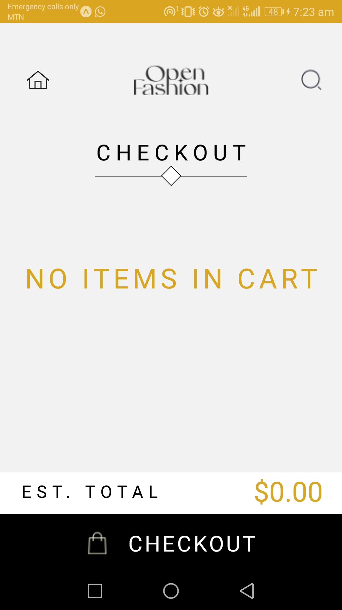
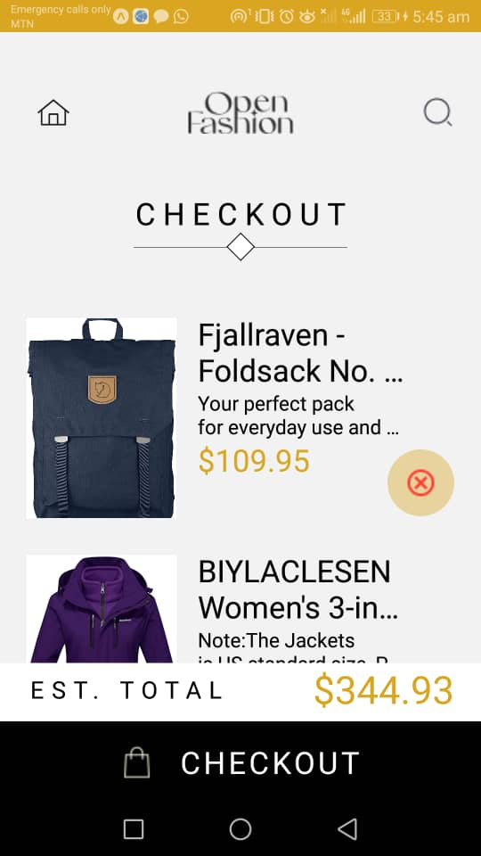
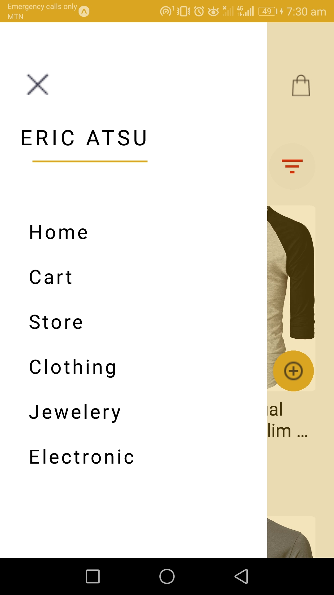
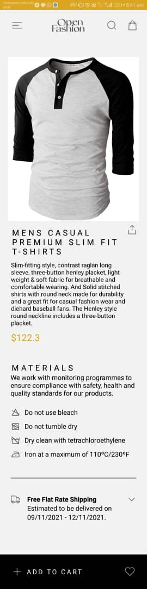

---

# rn-assignment7-11222100

Repository for a React Native app mimicking a provided UI mockup. Features include HomeScreen for product listing, CartScreen for managing selections, and functionalities for adding/removing items. Utilizes AsyncStorage for local data storage.


## Overview

This React Native project is created as part of the DCIT202 Mobile Application Development Assignment 6. The app provides a simple e-commerce interface where users can view a list of products, add them to a cart, and remove them from the cart. The app uses local storage to persist the cart items.

## How to Run

1. Clone the repository:
   ```bash
   git clone https://github.com/St-Programming-Sai/rn-assignment7-11222100.git
   ```
2. Navigate to the project directory:
   ```bash
   cd rn-assignment7-11222100
   ```
3. Install dependencies:
   ```bash
   npm install
   ```
4. Run the project:
   ```bash
   npm start
   ```

## Features

- **Home Screen**: Displays a list of available products.
- **Cart Screen**: Displays the selected items.
- **Add to Cart**: Users can add products to their cart.
- **Remove from Cart**: Users can remove products from their cart.
- **Local Storage**: Uses AsyncStorage to store selected items locally on the device.

## Components

1. **App**
   - Sets up the navigation container and stack navigator.
   - Defines routes for Home and Cart screens.

2. **Home**
   - Renders the home screen containing the product list.
   - Utilizes the `Products` component to display the list.

3. **CartScreen**
   - Renders the cart screen displaying selected items.
   - Displays the estimated total price and checkout button using the `Footer` component.
   - Utilizes the `Items` component to display cart items with remove functionality.

4. **Products**
   - Renders the list of products with add-to-cart buttons.
   - Handles the addition of products to the cart and stores them using AsyncStorage.

5. **HomeScreen/Header**
   - Displays the header section of the home screen.
   - Contains navigation buttons and the app logo.

6. **CartScreen/Header**
   - Displays the header section of the cart screen.
   - Contains navigation buttons and the app logo.

7. **CartScreen/Footer**
   - Displays the estimated total and checkout button at the bottom of the cart screen.

8. **CartScreen/Items**
   - Renders the list of items in the cart.
   - Provides functionality to remove items from the cart.

9. **HomeScreen/Options**
   - Renders UI options like menu and filters in the home screen header.

10. **CustomSideBarNavigation**
    - Provides navigation options in a sidebar.

11. **ProductDetails**
    - Renders detailed information about a selected product.
    - Displays product image, title, category, description, price, laundry guide (if applicable), shipping information, and provides an "Add to Cart" button.

12. **DataContext**
    - Provides context for fetching and storing product data.

## Design Choices

- **UI Design**: The UI is designed to be simple and user-friendly, following the provided UI mockup. It uses clean and modern design elements to enhance user experience.
- **Navigation**: Implemented using React Navigation to allow seamless transition between the home and cart screens. The `CustomSideBarNavigation` component provides additional navigation options in a sidebar.
- **Local Storage**: Used AsyncStorage for persistent storage of cart items to maintain state across app sessions. This ensures that the user's cart items are saved even when the app is closed and reopened.

### Data Storage

- **AsyncStorage**: Used to store the selected items in the cart. Each product is saved with a unique key (`@product_<key>`). This allows for easy retrieval and management of cart items.

### Screenshots
---

<p align="center">
  
  
  
  
  <br>
  
  <br>
  
</p>

---
---